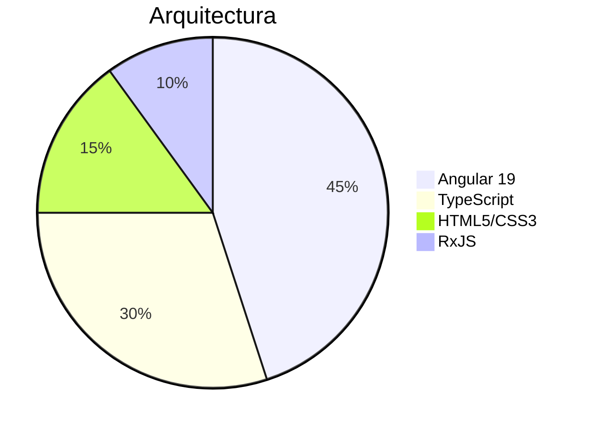

# 🅰️ AngularPracticas - Proyecto de Desarrollo Avanzado

> *"Potenciando aplicaciones web con las mejores prácticas de Angular"*

## 🚀 Características Principales
- ✅ Estructura modular escalable
- 🛠️ Generación de componentes con Angular CLI
- ⚡ Optimización para producción integrada
- 🧪 Soporte para testing end-to-end

## 🛠️ Stack Tecnológico

